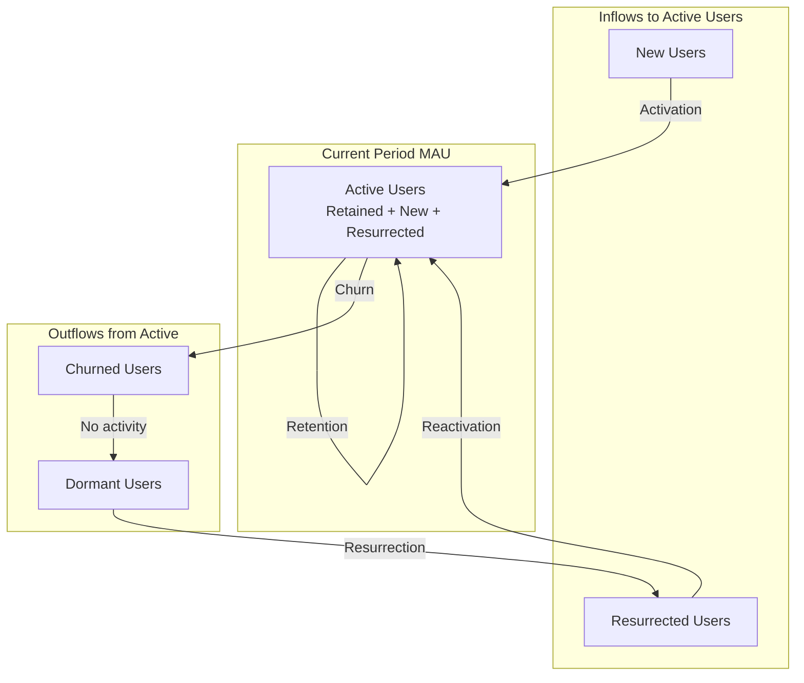
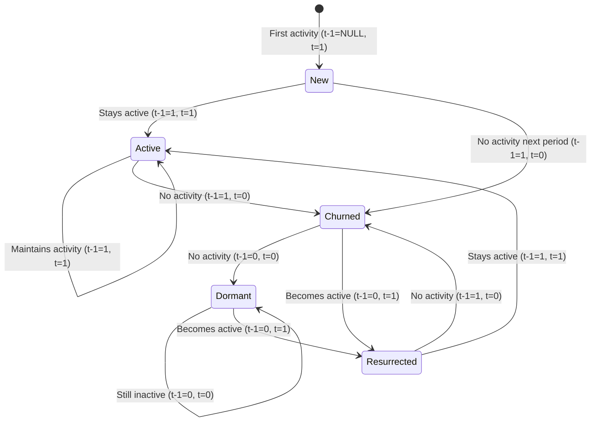
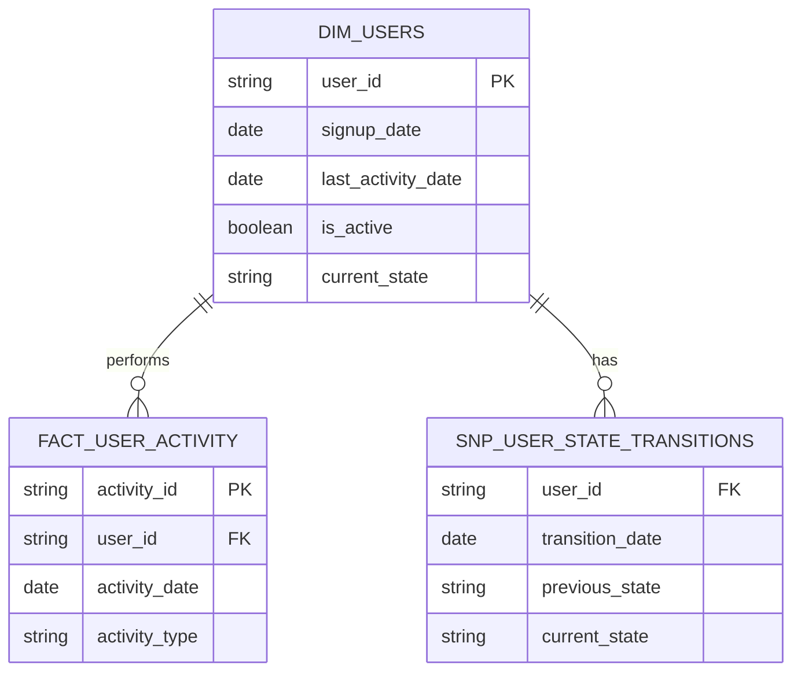
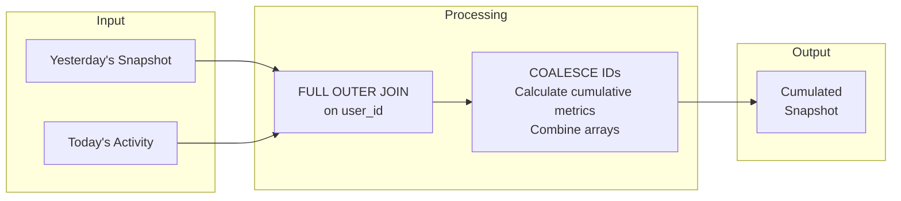

# Growth Accounting Framework

A practical approach to tracking user lifecycle states and measuring product growth.

---

## Why Growth Accounting Matters

We can effectively monitor user behavior by defining clear user states and establishing explicit conditions for transitions between them. Implementing a structured data model that captures these states and transitions enables:

- Analysis of user engagement patterns
- Identification of potential churn risks
- Formulation of targeted re-engagement strategies
- Consistent segmentation across time periods (daily L1D, weekly L7D, monthly L30D)



---

## Simplified vs. Granular Approaches

| Approach | Pros | Cons |
|----------|------|------|
| **Granular** (New, Active, At-Risk, Churned, Reactivated) | More detailed insights into engagement trends. Allows refined segmentation and personalized re-engagement. | Complex to implement, maintain, and keep MECE. May fragment states unnecessarily. |
| **Simplified** (New, Retained, Churned, Resurrected, Dormant) | Easier to implement, aligns with established frameworks. Provides high-level, actionable view of growth dynamics. | Lacks nuance (no "At-Risk" state). Limited proactive churn mitigation. |

**Recommendation:** Start with simplified growth accounting, then evolve to granular when needed. You can flexibly change what constitutes "present" and "past" time periods.

---

## State Definitions

| State | Definition | Logic |
|-------|------------|-------|
| **Never Active** | User who joined but has not done any activity | `current_state = NULL`, `previous_state = NULL` |
| **New** | User first active in the present period (not seen in previous period) | `current_state = 1`, `previous_state = NULL` |
| **Retained** | User active in previous period and remains active in current | `current_state = 1`, `previous_state = 1` |
| **Churned** | User active in previous period but not engaged in current | `current_state = 0`, `previous_state = 1` |
| **Dormant** | User active in the past, but not in current or previous period | `current_state = 0`, `previous_state = 0` |
| **Resurrected** | User previously churned but became active again | `current_state = 1`, `previous_state = 0` |

---

## State Transition Flow



---

## Key Metrics & Equations

### 1. Current Active Users (MAU)

```
MAU(t) = Retained(t) + New(t) + Resurrected(t)
```

### 2. Previous Period Active Users

```
MAU(t-1) = Retained(t) + Churned(t)
```

### 3. Net Adds

```
MAU(t) - MAU(t-1) = New(t) + Resurrected(t) - Churned(t)
```

### 4. Gross Retention Rate

```
Gross Retention = Retained(t) / MAU(t-1)
```

### 5. Quick Ratio (Health of Growth)

```
Quick Ratio = (New(t) + Resurrected(t)) / Churned(t)
```

- **Quick ratio > 1** indicates growth
- **Quick ratio < 1** suggests losing more users than gaining

---

## Data Modeling Approach

The common pattern is a **cumulative/snapshot table** containing state transitions between today's and yesterday's data. This stochastic process enables snapshot queries by partition date.

### Benefits

- **Faster Reads**: Retain all historical data in one table without complex shuffles or group-bys
- **Easy Metrics**: Track churn, resurrection, and activation with simple WHERE and GROUP BY clauses

### Tradeoffs

- **Sequential Backfilling**: Data relies on prior days' snapshots, making parallel backfilling impossible
- **Bloated Tables**: Snapshots include all users, even churned ones with no activity

### Mitigations

- **Aggregation**: Pre-aggregate metrics at the appropriate grain
- **Simplify States**: Keep tables normalized—don't include denormalized info if not needed for state calculation

---

## Schema Design



---

## Example State Transition Data

| user_id | transition_date | is_active | is_active_previous | current_state | previous_state |
|---------|-----------------|-----------|-------------------|---------------|----------------|
| U001 | 2025-02-11 | TRUE | NULL | new | NULL |
| U001 | 2025-02-12 | TRUE | TRUE | active | new |
| U001 | 2025-02-13 | FALSE | TRUE | churned | active |
| U001 | 2025-02-14 | TRUE | FALSE | resurrected | churned |

---

## SQL Implementation

### Building the Snapshot Table



**Steps:**
1. Get yesterday's data + today's data
2. Apply FULL OUTER JOIN on user_id (or choice grain)
3. COALESCE IDs and calculate cumulative metrics
4. Output is accumulated history

### Growth Accounting Query

```sql
WITH agg_user_state_metrics AS (
    SELECT
        transition_date,
        COUNT(CASE WHEN current_state = 'New' THEN user_id END) AS new_count,
        COUNT(CASE WHEN current_state = 'Active' THEN user_id END) AS active_count,
        COUNT(CASE WHEN current_state = 'Churned' THEN user_id END) AS churned_count,
        COUNT(CASE WHEN current_state = 'Resurrected' THEN user_id END) AS resurrected_count
    FROM snp_user_state_transitions
    GROUP BY transition_date
)
SELECT
    transition_date,
    new_count + resurrected_count - churned_count AS net_adds
FROM agg_user_state_metrics
```

---

## References

- [Retention Lifecycle Framework](https://www.reforge.com/blog/retention-engagement-growth-silent-killer) – States to consider when segmenting users
- [Duolingo's Growth Model](https://www.lennysnewsletter.com/p/how-duolingo-reignited-user-growth) – Classification of users for growth accounting
- [Amplitude on Growth Accounting](https://amplitude.com/blog/growth-accounting) – Simplified growth accounting approach
